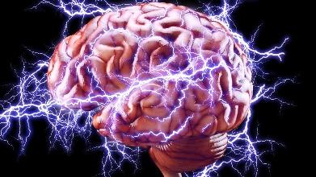
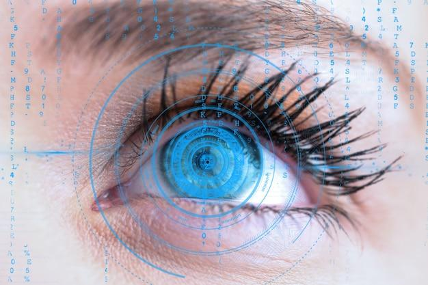
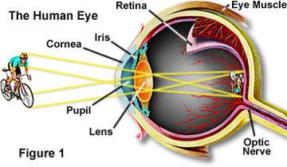

**Introduction to Image Processing**

Intro: Image processing is like using special tools to change and
understand pictures. We can make pictures look better, find important
information in them, and even teach computers to see what's in them. We
use image processing in medicine, security, and many other fields. It
helps us do things that we couldn't do before, like finding diseases in
X-rays or detecting objects in surveillance videos.

Digital Image: A digital image is basically a picture that has been
created or captured using digital technology like a camera or computer
software. Instead of being printed on paper or film, the image is turned
into electronic signals \[When we take a picture with
a digital camera, the camera's image sensor converts the light that
passes through the lens into electronic signals. Each pixel on the image
sensor corresponds to a specific location in the image, and the
electronic signal from that pixel represents the color and brightness of
that location.

Once the image has been captured, it can be stored
and manipulated on a computer or other digital device. Techniques of
digital image processing are used to manipulate electronic signals in
various ways to produce a final image with desired properties, such as
color balance, contrast, and sharpness.

So electronic signals are basically like a digital
version of the picture, representing the colors and brightness of each
pixel. By manipulating these electronic signals, we can create and
enhance digital images on a computer or other digital device.

\] that can be stored and manipulated on a
computer or other digital device.

So when you look at a picture on your phone or computer screen, it's
actually just a bunch of electronic signals that your device converts
back into the image you see. \[ This process of
converting electronic signals into an image is known as image
processing. Image processing involves a series of techniques that can be
used to manipulate and enhance images in various ways, such as improving
image resolution, removing noise, and highlighting important features.
The electronic signals that make up an image can be processed in many
different ways, depending on the specific application and the desired
outcome. These techniques can range from simple operations, such as
brightness and contrast adjustments, to more complex algorithms, such as
machine learning-based image recognition.\]

Digital images are like a big puzzle made up of tiny colored dots called
pixels. The more pixels there are, the clearer and sharper the image
will be. The number of pixels in an image is called its
resolution.720\*550 . \[For example, let's consider
an image with a resolution of 720 x 550 pixels. This means that the
image is made up of 720 columns of pixels and 550 rows of pixels. Each
pixel in the image represents a small area of the overall picture and
has a specific color value assigned to it. By combining these pixels
together, the image is created, and the more pixels there are, the
higher the level of detail and clarity in the image. The idea of what a
pixel looks like, imagine a small colored square on the screen. This
square is a pixel, and each pixel in an image is like a small building
block that comes together to create the overall image. \]

Another factor that affects the quality of a digital image is its color
depth, which refers to the number of colors that can be represented in
the image. The higher the color depth, the more vibrant and accurate the
colors will
appear.

Lastly, the file format of the digital image also plays a role in its
quality. Different file formats have different levels of compression,
which can affect the sharpness and clarity of the
image.

In digital image processing, a file format is a standardized way of
organizing and storing image data in a file. Digital images can be saved
in different file formats that are like containers for the image data.
Each file format has its own features and properties that make it
suitable for different purposes.

JPEG: Joint Photographic Experts Group (JPEG) is a popular lossy
compression format used for photographs and digital images. JPEG is
widely used because it allows for a high level of compression while
maintaining good image quality. The downside of JPEG is that it can lead
to loss of image quality due to compression artifacts.
\[The size of a JPEG image can vary depending on the
amount of compression applied to the image. The minimum size of a JPEG
image depends on the resolution and color depth of the image, while the
maximum size is limited by the available storage space. The size of a
JPEG image is typically measured in kilobytes (KB) or megabytes (MB),
where 1 MB is equal to 1024 KB.

JPEG is a suitable image format for photographs and
digital images where the quality of the image needs to be maintained
while also keeping the file size as small as possible. \]

PNG: Portable Network Graphics (PNG) is a lossless format that supports
transparency and is commonly used for images that require transparency,
such as logos and icons. PNG files are larger than JPEG files, but they
offer better image quality.

BMP: Bitmap (BMP) is an uncompressed format that supports a wide range
of color depths and is commonly used for printing. BMP files are very
large and are not recommended for use on the web or other applications
where file size is important.

TIFF: Tagged Image File Format (TIFF) is a lossless format that supports
a wide range of color depths and is commonly used for professional
photography and printing. TIFF files are very large and are not suitable
for use on the web.

GIF: Graphics Interchange Format (GIF) is a lossless format commonly
used for small animations and graphics on the web. GIF files support
transparency and can be animated, making them popular for web designers.

RAW: RAW files are uncompressed and unprocessed image files that contain
all the data captured by the camera's sensor. RAW files are typically
used by professional photographers who require maximum control over the
image processing.

EPS: Encapsulated PostScript (EPS) is a vector graphics format commonly
used for printing. EPS files can be resized without loss of quality and
are commonly used for logos, illustrations, and diagrams.

ICO: Icon (ICO) is a file format used for icons on Windows operating
systems. ICO files can contain multiple sizes and color depths of the
same image.

CDR: CorelDRAW (CDR) is a vector graphics format used by CorelDRAW
software. CDR files are commonly used for logos, illustrations, and
other types of graphics.

SVG: Scalable Vector Graphics (SVG) is a vector graphics format commonly
used for web graphics. SVG files are scalable, which means they can be
resized without loss of quality.

AI: Adobe Illustrator (AI) is a vector graphics format commonly used for
illustrations, logos, and other types of graphics. AI files are commonly
used by graphic designers and can be resized without loss of quality.

PSD: Photoshop Document (PSD) is a layered image format used by Adobe
Photoshop software. PSD files are commonly used for graphic design and
editing, and they support layers and various image effects.

\[When conducting research in the field of medical
imaging for deep learning, it is important to use image formats that
preserve the accuracy and quality of the images. Formats like PNG or
TIFF use lossless compression, which means that they do not lose any
image data during compression. This is important because lossy
compression formats like JPEG can lead to image artifacts, which can
negatively impact the accuracy of deep learning models. \]

The choice of file format depends on the intended use of the image.

If the image is intended for use on the web, then a JPEG, PNG, GIF, or
SVG format may be suitable.

If the image requires transparency or is intended for professional
printing, then a PNG, EPS, TIFF, or PSD format may be better.

If the image is intended for use as an icon, then an ICO format may be
the best choice.

If the image was captured by a camera in RAW format, it may require
processing and conversion to another format for further use.

\[When an image is captured by a camera, it is often
saved in a specific file format depending on the camera settings. There
are several different image file formats that cameras can save images
in, but the most common formats are RAW, JPEG, and TIFF.

RAW format is a type of image format that captures
all the data from the camera's image sensor without any processing or
compression. This format is often used by professional photographers
because it provides the highest level of flexibility for editing and
processing the image later on. RAW files are typically very large in
size, and they can only be opened and edited using specialized
software.

JPEG format is a lossy image format that is widely
used for capturing and sharing photos. The JPEG format compresses the
image to reduce its size, which can result in some loss of quality.
However, the level of compression can be adjusted to balance image
quality and file size. JPEG files are compatible with most image editing
software and can be easily shared or uploaded online.

TIFF format is a lossless image format that captures
all the data from the camera's image sensor without any loss of quality.
TIFF files are very large in size and are often used for professional
printing or archival purposes.\]

In a digital image, a pixel is a tiny square of color that combines with
other pixels to create an overall image. The pixel values in a digital
image can represent different things, depending on the type of image and
what it's being used for. For example, in a black-and-white image, the
pixel values represent different shades of gray, with black being the
darkest and white being the lightest.

In a color image, the pixel values represent different levels of red,
green, and blue, which combine to create all the different colors you
see. In other types of images, such as height maps and opacity maps, the
pixel values represent different attributes, like elevation or
transparency \[In a color image, each pixel is made
up of three color channels: red, green, and blue (RGB). The intensity of
each color channel in a pixel determines the final color of that pixel.
For example, if the red channel of a pixel is set to a high value while
the green and blue channels are set to lower values, the pixel will
appear as a shade of red. By varying the intensity of the different
color channels, millions of different colors can be created in a color
image.

In other types of images, such as height maps and
opacity maps, pixel values can represent different attributes. For
example, in a height map, the pixel values represent the elevation of a
surface. Higher values represent higher elevations, while lower values
represent lower elevations. In an opacity map, the pixel values
represent the transparency of a surface. Higher values represent greater
opacity, while lower values represent greater transparency.

These different types of images may use different
data formats to represent pixel values. For example, height maps may use
a grayscale format where the pixel values range from black to white to
represent elevation. Opacity maps may use a single channel of color data
where the pixel values range from fully transparent to fully opaque. The
specific format used depends on the requirements of the image and the
software used to create or process it.\].

When we take a picture or scan an image, we're basically converting a
real-life scene into a digital representation that is made up of tiny
dots called pixels. \[These tiny dots pixels are the
smallest unit of information that a digital image can be divided
into.

A camera captures the scene by using a lens to focus
light onto an electronic sensor or a film that is sensitive to light.
The sensor or film is made up of many small photosensitive elements
called "photosites", which record the amount of light that falls on
them. Each photosite corresponds to a single pixel in the final image.
So, when we take a picture, the camera records the amount of light that
falls on each photosite and stores it as a value that represents the
brightness of that pixel. \]

These pixels come in different colors or shades of gray, and they're
arranged in a grid-like pattern to form the overall image. However,
because this is an approximation of the real scene, some details can be
lost or changed in the process. To get a good quality digital image, we
need to consider factors like how many pixels are used (resolution), how
often the real scene is sampled (sampling rate), and how many different
colors or shades of gray can be represented by each pixel (quantization
levels).

\[Resolution refers to the number of pixels in an
image. In practical terms, a higher resolution means that there are more
pixels per unit area, resulting in a clearer and more detailed image.
The resolution of an image is typically measured in terms of its width
and height, in pixels. For example. If an image has M rows and N
columns, then its resolution can be defined as M X N.

If we define resolution as the total number of
pixels, then pixel resolution can be defined with a set of two numbers.
The first number is the width of the picture or the pixels across
columns, and the second number is the height of the picture or the
pixels across its width. We can say that the higher the pixel
resolution, the higher the quality of the image.
\]

There are different types of digital image formats, and they vary in
terms of the number and types of samples per point that they store. A
sample is a value that represents some property of the image at a
particular point or location. The most common types of samples are:

1 sample per point: This format is used for black and white or grayscale
images. Each point in the image is represented by a single sample value
that corresponds to the brightness or intensity of that point. The range
of possible values for each sample depends on the bit-depth of the
format. For example, an 8-bit grayscale image has 256 possible intensity
levels (0 to 255), while a 16-bit grayscale image has 65,536 possible
intensity levels (0 to 65,535). 

\[ Intensity refers to the brightness or color of a
pixel in an image. It's like how bright or dark a pixel appears on your
screen. A higher intensity value means a brighter or more intense color,
while a lower intensity value means a darker or less intense color.
\]

3 samples per point: This format is used for color images that are
composed of red, green, and blue (RGB) channels. Each point in the image
is represented by three sample values that correspond to the amount of
red, green, and blue light at that point. The range of possible values
for each sample is the same as for grayscale images. By combining the
RGB channels, any color can be represented, with over 16 million
possible color combinations.

4 samples per point: This format is used for color images that have an
additional alpha channel, which stores information about the opacity or
transparency of each point. The alpha channel sample values typically
range from 0 (fully transparent) to 255 (fully opaque). This allows for
the creation of images with varying degrees of transparency, which can
be useful for graphic design, photo editing, and other
applications.

\[ The file extension for this format with 4 samples
per point and an additional alpha channel is typically .tiff or .tif
(Tagged Image File Format). This format is commonly used for
high-quality graphics and photographs and supports a wide range of color
depths and resolutions.\]

Gray Level Image:

A grayscale or gray-level image is a type of digital image where the
pixel values represent shades of gray, ranging from black (darkest) to
white (brightest). In a grayscale image, each pixel has a single value
\[for example, a value of 128 represents a shade of
gray that is halfway between black and white which indicates the
intensity of the gray shade at that point. So, if we have a grayscale
image with a resolution of 1000 x 1000 pixels, each pixel in the image
will have a single value between 0 (black) and 255 (white) that
represents the intensity of the gray shade at that point. \] that
indicates the intensity of the gray shade at that
point.

Gray-level images are commonly used in applications where color is not
necessary or important, such as medical imaging, X-rays, and document
scanning. Since they don't require color information, the focus is on
the intensity or brightness of the image. The pixel values in an 8-bit
grayscale image can range from 0 (black) to 255 (white), although other
bit depths can also be used.

Gray-level images are often preferred over color images in applications
that require less memory to store and process, making them more
efficient for certain purposes. For example, they can be used in machine
vision to detect edges and boundaries, or in document processing to
enhance text contrast and readability.

\[Not all digital images are color images. In fact, there are two main
types of digital images: grayscale images and color images. Grayscale
images are made up of pixels that represent shades of gray ranging from
black to white, with each pixel having a single value indicating the
intensity of the gray shade at that point.

On the other hand, color images are made up of pixels that contain
values for each color channel (such as red, green, and blue), which
combine to produce a wide range of colors. However, grayscale images
contain only one channel of information, representing only the
brightness or intensity of the image. Therefore, grayscale images are
considered a type of monochrome image, meaning that they contain only
one color channel.\]

Color Image:

A color image is a type of digital image that consists of three color
channels: red, green, and blue. Each pixel in the image is made up of
these three color channels and is represented by integer values ranging
from 0 to 255. The combination of these color channels creates a wide
range of colors, allowing for the creation of vivid and realistic
images.

To display a color image, the values of the red, green, and blue color
channels are added together for each pixel, resulting in a final color
for that pixel. For instance, a pixel with a red value of 200, a green
value of 50, and a blue value of 100 would produce a reddish-orange hue
when combined.

Color images can be viewed on computer monitors, printed on paper, or
stored in digital files using various file formats such as JPEG, PNG,
and TIFF. They are widely used in photography, digital art, graphic
design, and other fields where color is an essential component of the
image.

\[RGB (255, 0, 0) = red

RGB (0, 255, 0) = green

RGB (0, 0, 255) = blue

RGB (255, 255, 0) = yellow

RGB (255, 0, 255) = magenta \]

What is digital image processing (DIP)?

Digital Image Processing (DIP) is the use of computer programs to
manipulate digital images. It involves techniques and algorithms that
are used to enhance, analyze, or transform digital images. The main goal
of DIP is to improve the quality of images so that they can be better
interpreted by humans, or to extract useful information from them that
can be used in other applications.

DIP can involve a wide range of tasks, such as removing noise,
correcting distortions, enhancing contrast and colors, and extracting
quantitative data from images. These tasks are often performed using
specialized software or programming languages, such as MATLAB, Python,
or OpenCV.

DIP has three main areas of focus:

- Image Enhancement: This area of DIP involves improving the visual
  > appearance of an image to make it more useful for human
  > interpretation. Some common image enhancement techniques include:

> Contrast stretching: Adjusting the image intensity levels to make dark
> regions darker and bright regions brighter.
>
> Sharpening: Enhancing the edges in an image to make it appear sharper
> and clearer.
>
> Denoising: Removing random variations or "noise" from an image to
> improve its clarity.

- Image Analysis: This area of DIP involves analyzing an image to
  > extract quantitative information that can be used in other
  > applications. Some common image analysis techniques include:

> Object recognition: Identifying and classifying objects in an image.
>
> Image segmentation: Dividing an image into multiple regions based on
> similar characteristics.
>
> Feature extraction: Identifying and extracting specific features from
> an image, such as edges or corners.

- Image Restoration: This area of DIP involves repairing or restoring an
  > image that has been degraded or damaged in some way. Some common
  > image restoration techniques include:

> Image interpolation: Creating new pixels to fill in gaps or missing
> information in an image.
>
> Deblurring: Removing blurring caused by camera or motion shake.
>
> Inpainting: Filling in missing or damaged regions of an image based on
> surrounding information.

Image processing: This involves using algorithms to transform images,
such as filtering, segmentation, or edge detection. The input and output
of image processing are both images.

- \[Filtering: Filtering can be used to remove noise
  > or blur an image. For example, a low-pass filter can be used to
  > remove high-frequency noise from an image, resulting in a smoother
  > image.

- Segmentation: Segmentation can be used to divide an
  > image into different regions or objects. For example, in medical
  > imaging, segmentation can be used to identify and isolate tumors or
  > other abnormalities.

- Edge detection: Edge detection can be used to
  > identify the boundaries between different regions in an image. For
  > example, in computer vision, edge detection can be used to identify
  > the edges of objects in an image.

- Morphological operations: Morphological operations
  > can be used to enhance or extract features in an image. For example,
  > erosion can be used to remove small features, while dilation can be
  > used to fill in gaps or expand features.

- Image smoothing or blurring: This can be achieved
  > using algorithms such as Gaussian blur or median filter to remove
  > noise and produce a smoother image.

- Image sharpening: This involves enhancing the edges
  > and details in an image using algorithms such as unsharp masking or
  > high-pass filtering.

- Image thresholding: This is used to separate an
  > image into regions of interest by converting it to a binary image,
  > where pixels are either black or white based on a threshold
  > value.

- Image compression: This involves reducing the size
  > of an image file while minimizing loss of quality, using techniques
  > such as JPEG or PNG compression. \]

Image analysis: This involves using algorithms to extract quantitative
data from images, such as measuring the size of objects, counting the
number of pixels in an image, or detecting patterns. The input is an
image, and the output is quantitative data.

\[The number of pixels in an image is important
because it determines the image resolution and quality. The more pixels
an image has, the higher its resolution and the more detail it can
capture. This is important for applications where image details need to
be preserved, such as in medical imaging or satellite imagery.\]

Image understanding: This involves using algorithms to interpret the
content of images at a higher level, such as recognizing objects or
scenes. The input is an image, and the output is a high-level
interpretation of the image content.

DIP has many practical applications in various fields, such as medical
imaging, remote sensing, surveillance, and entertainment. For example,
in medical imaging, DIP techniques can be used to enhance images of
internal organs, detect tumors, or measure blood flow. In remote
sensing, DIP can be used to analyze satellite images to identify land
use patterns, track weather patterns, or monitor environmental changes.

DIP is an important field that allows us to extract useful information
from digital images and improve their quality for various applications.

Why is it important to learn Digital Image Processing (DIP)?

DIP is important because it enables us to manipulate and analyze digital
images for a variety of purposes. Learning DIP allows us to improve the
quality of images, extract useful information from them, and transform
them into different representations. It is also a crucial tool for
researchers and scientists in various fields, as it allows them to
process and analyze large amounts of visual data quickly and discover
insights that would be difficult to detect manually. By learning DIP,
researchers can develop new algorithms and techniques to automate image
analysis, making their work more efficient and effective.

# 

# The key stages of digital image processing

Image acquisition is the process of capturing an image and converting it
into a digital format that can be stored and manipulated by a computer.
It involves the use of a device, such as a camera, scanner, or sensor,
to capture the image and convert it into a series of digital values that
represent the image's pixels.

The process of image acquisition is important in many fields, including
photography, medicine, and security, where the ability to capture and
analyze images can provide valuable information. It involves not only
capturing the image, but also optimizing the process to produce
high-quality images with accurate color and resolution.

1.  Capturing a photograph with a digital camera: The
    > camera's sensor captures the image and converts it into a digital
    > format that can be stored and manipulated by a computer.

2.  Scanning a document with a scanner: The scanner
    > captures an image of the document and converts it into a digital
    > format that can be stored and manipulated by a computer.

3.  Using a satellite to capture an image of the
    > Earth's surface: The satellite's sensor captures the image and
    > transmits it back to Earth, where it can be stored and analyzed by
    > a computer.

4.  Using a microscope to capture an image of a
    > biological sample: The microscope's camera captures the image and
    > converts it into a digital format that can be stored and
    > manipulated by a computer.

Camera Capturing an image and its technical
matter.

- Light enters through the lens: The lens on the
  > camera allows light to enter and focuses it onto the camera's image
  > sensor.

- The image sensor converts light into electrical
  > signals: The image sensor, typically a charge-coupled device (CCD)
  > or complementary metal-oxide-semiconductor (CMOS) sensor, converts
  > the light that enters through the lens into electrical
  > signals.

- Analog-to-digital conversion: The electrical
  > signals are then converted from analog to digital signals, which can
  > be processed and stored by a computer.

- Image processing: The digital signals are then
  > processed by the camera's internal software to create an image file
  > that can be stored and displayed.\]

Image enhancement refers to the process of improving the visual quality
of an image, by adjusting its brightness, contrast, color balance,
sharpness, etc. The aim of image enhancement is to highlight specific
features of the image, or to make it more visually appealing and easier
to interpret.

There are various techniques used in image enhancement, such as
filtering, histogram equalization, contrast stretching, sharpening,
noise reduction, and many more. These techniques can be applied to both
grayscale and color images, and can be performed manually or
automatically using software tools.

Image enhancement has many practical applications, such as in medical
imaging, satellite imaging, surveillance, and digital photography. By
improving the quality of the images, it can help to improve the accuracy
and effectiveness of image analysis and interpretation.

Image restoration is the process of restoring an image that has been
degraded or corrupted by noise, blur, or other forms of distortion. The
goal of image restoration is to recover the original image as accurately
as possible by removing or minimizing the effects of degradation.

There are various techniques used in image restoration, including
spatial domain methods such as Wiener filtering, inverse filtering, and
median filtering, and frequency domain methods such as Fourier
Transform, wavelet Transform, and restoration using Neural Networks.
These techniques can be applied to restore images that have been
degraded due to factors such as motion blur, camera shake, and noise.

Image restoration has numerous applications, such as in medical imaging
to enhance the clarity of X-ray or MRI images, in astronomy to improve
the quality of images captured by telescopes, and in forensic analysis
to restore and enhance degraded images for use in criminal
investigations.

Morphological processing is a type of digital image processing that
deals with the shape and form of objects in an image. It involves the
use of mathematical operations called morphological operators to extract
important features from an image, such as edges, boundaries, and shapes.

Morphological processing is particularly useful in applications where
the shape or size of objects in an image is important, such as in
medical imaging, surveillance, and robotics. Morphological operations
are performed on binary or grayscale images, and typically involve the
use of structuring elements, which are small, predefined shapes that are
used to probe or scan the image.

The two most common morphological operations are erosion and dilation.
Erosion involves shrinking or eroding the boundaries of an object in an
image, while dilation involves expanding or dilating the boundaries of
an object. Other morphological operations include opening, closing, and
boundary extraction. These operations can be combined in various ways to
extract specific features from an image, such as detecting the edges of
an object or removing noise.

Segmentation in digital image processing refers to the process of
dividing an image into multiple segments or regions, with each segment
representing a distinct object or part of the image. The goal of
segmentation is to simplify the image and make it more meaningful and
easier to analyze. It is an important step in many image processing
applications, such as object recognition, image compression, and image
editing.

There are various techniques used for segmentation, including
thresholding, edge-based segmentation, region-based segmentation, and
clustering. Thresholding involves setting a threshold value for the
pixel intensities, with pixels above the threshold being classified as
one region and pixels below the threshold being classified as another
region. Edge-based segmentation involves detecting edges or boundaries
between regions, while region-based segmentation involves grouping
pixels together based on their intensity and spatial properties.
Clustering techniques involve grouping pixels into clusters based on
their similarity in color or texture.

Overall, segmentation is an important step in digital image processing
as it can help to extract meaningful information from images and improve
the accuracy and efficiency of subsequent processing tasks.

Representation and description in digital image processing are
techniques used to extract important features from an image and
represent them in a more meaningful and compact way. The ultimate goal
of these techniques is to simplify the image content, making it easier
to analyze, recognize, and interpret.

Image representation involves reducing the complexity of an image by
extracting its essential features and ignoring irrelevant or redundant
information. This is done using various techniques such as filtering,
feature detection, and transformation. For example, an image can be
represented in the frequency domain using Fourier transform, which
separates the image into its constituent frequencies, or in the spatial
domain using histograms, which provide a statistical description of the
image content.

Image description involves quantifying the extracted features to provide
a more compact and meaningful representation of the image. This can be
done using various techniques such as feature extraction, feature
matching, and classification. For example, an image can be described by
its texture, shape, color, or a combination of these features. These
features can then be used to classify the image or identify specific
objects within it.

Object recognition is a subfield of computer vision and image processing
that deals with identifying specific objects or patterns within an image
or video. The main goal of object recognition is to teach machines to
automatically identify and classify objects in the same way that humans
do.

Object recognition typically involves several stages, including image
acquisition, image pre-processing, feature extraction, and
classification. During the pre-processing stage, the image is typically
cleaned and enhanced to reduce noise and highlight important features.
Next, various features such as shape, texture, and color are extracted
from the image using various techniques.

These features are then used to train machine learning algorithms, such
as neural networks or support vector machines, to classify the objects
in the image. Once the algorithm has been trained, it can be used to
automatically recognize objects in new images or videos.

Applications of object recognition include self-driving cars, facial
recognition, robotics, and surveillance systems.

Image compression is the process of reducing the size of a digital image
file while maintaining its visual quality as much as possible. This is
typically done to save storage space and to make image transmission over
networks more efficient. There are two main types of image compression:
lossy and lossless.

calculate image size:

Image Size = Number of Pixels × Bit Depth

where:

Number of Pixels: the total number of pixels in the
image, calculated as width × height.

Bit Depth: the number of bits used to represent each
pixel. For example, a bit depth of 8 means each pixel is represented by
8 bits (or 1 byte) of data.

Once you have calculated the image size in bits, you
can convert it to more common units like bytes, kilobytes (KB),
megabytes (MB), gigabytes (GB), or terabytes (TB) using the following
conversions:

1 byte = 8 bits

1 KB = 1024 bytes

1 MB = 1024 KB

1 GB = 1024 MB

1 TB = 1024 GB

For example, let's say you have an image that is 1000
pixels wide and 800 pixels high, and each pixel is represented by 24
bits of data (i.e., a bit depth of 24). To calculate the image
size:

Number of Pixels = 1000 x 800 = 800,000 pixels

Bit Depth = 24 bits

Image Size = 800,000 x 24 = 19,200,000 bits

To convert this to megabytes (MB):

19,200,000 bits / 8 bits per byte = 2,400,000
bytes

2,400,000 bytes / 1024 bytes per KB = 2,343.75
KB

2,343.75 KB / 1024 KB per MB = 2.29 MB

So the image size is approximately 2.29 MB.

Lossless compression algorithms reduce the file size of an image without
losing any data or image quality. This is achieved by identifying and
removing any redundant or unnecessary data in the image file

Unnecessary data :

1.  In a research study, collecting data that is not
    > relevant to the research question or hypothesis is unnecessary
    > data. For example, if a study is examining the effects of a new
    > medication on blood pressure, collecting data on the participants'
    > hair color would be unnecessary.

2.  In a software application, storing data that is
    > not required for the application to function properly is
    > unnecessary data. For example, if an app requires a user's name
    > and email address to sign up, storing their birthdate or social
    > security number would be unnecessary.

3.  In a spreadsheet or database, including columns
    > or fields that are not being used or are redundant is unnecessary
    > data. For example, if a spreadsheet is tracking sales data,
    > including a column for the date of the week when the sale occurred
    > would be unnecessary if the date of the sale is already being
    > tracked.

4.  In a presentation, including information or data
    > that is not relevant to the topic or does not support the main
    > message is unnecessary data. For example, including background
    > information on a company that is not relevant to the
    > presentation's purpose would be unnecessary.

Lossless compression algorithms are often used for medical and
scientific images, where preserving every detail is important.

Lossy compression algorithms reduce the file size of an image by
selectively removing certain data that are not essential for visual
quality. This can result in a significant reduction in file size, but at
the cost of some loss in image quality. Lossy compression algorithms are
often used for web images, where smaller file sizes are more important
than perfect image quality. Popular lossy compression formats include
JPEG, GIF, and PNG.

Color image processing refers to the processing of digital images that
contain color information. It involves manipulating the color values of
an image to enhance or modify its visual appearance or to extract useful
information from it. Color images are typically represented using RGB
(Red, Green, Blue) color model, where each pixel in the image is
represented by three values corresponding to the intensity of the red,
green, and blue components of the color.

Some common techniques used in color image processing include color
space conversions, color correction, color filtering, color
segmentation, and color feature extraction. These techniques can be used
in various applications such as digital photography, video processing,
medical imaging, and computer vision. For example, in digital
photography, color correction techniques can be used to adjust the color
balance of an image to make it look more natural or to create a certain
artistic effect. In medical imaging, color segmentation can be used to
identify regions of interest in an image, such as tumors or lesions,
based on their color characteristics.

There are two types of color images: grayscale and
full color. Grayscale images have only shades of gray, while full-color
images have colors that are a combination of red, green, and
blue.

In addition: CMYK (Cyan, Magenta, Yellow, Key/Black):
This type of color image is commonly used in printing. It represents
colors using a combination of cyan, magenta, yellow, and black values.
By varying the intensity of each color, a wide range of colors can be
represented.

RGB stands for red, green, blue, which are the
primary colors of light. Each pixel in a full color image is represented
by a combination of these three colors, with each color channel having a
value ranging from 0 to 255. This means that there are 256 possible
values for each color channel, and therefore, 256 \* 256 \* 256 =
16,777,216 possible color images that can be represented using
RGB.

# What is meant by visual perception?

- Visual perception refers to the process by which we interpret the
  > information we receive through our eyes and give meaning to it. This
  > involves both the physical process of seeing an image and the
  > cognitive processes that occur in our brains to interpret and make
  > sense of that
  > image. alt="The System of Visual Perception – Trevor Erickson: EDP 2300" />

> The visual perception system is a complex process that involves
> multiple stages, both in the eye and in the brain. Here are the basic
> steps involved in the system of visual perception:

1.  Light enters the eye through the cornea, a clear covering on the
    > front of the eye. The cornea helps to focus the incoming light.

2.  The light then passes through the pupil, the black circular opening
    > in the center of the iris, which adjusts its size to regulate the
    > amount of light that enters the eye.

3.  The light then travels through the lens, which further focuses the
    > light and projects it onto the retina, a thin layer of tissue at
    > the back of the eye.

4.  The retina contains specialized cells called photoreceptors that
    > convert the light into electrical signals, which are then
    > transmitted to the brain via the optic nerve.

5.  In the brain, the electrical signals are processed by multiple areas
    > of the visual cortex, where the visual information is analyzed and
    > interpreted. This process involves detecting basic features such
    > as color, shape, and motion, and then integrating these features
    > to form a coherent visual percept.

6.  Finally, the brain integrates the visual information with other
    > sensory information and prior knowledge to create a complete
    > understanding of the scene being viewed.

>  alt="KUPAL - Home" />
>
> There is a large difference between the image we display and the image
> we actually perceived by the viewer.
>
> This is because the visual perception system is influenced by many
> factors, including the lighting conditions in which the image is
> viewed, the angle at which the image is seen, the presence of
> distracting elements in the image, or the viewer's individual
> interpretation of the image based on their own experiences and biases.
>
> Cornea:
>
> During the day, the cornea allows more light to
> enter the eye, which helps us to see things clearly and with sharp
> detail. The pupil also constricts in bright light to reduce the amount
> of light that enters the eye, further enhancing our visual acuity.
> Additionally, during the day, our eyes are more sensitive to colors in
> the green and yellow parts of the spectrum.
>
> At night, the cornea and pupil work differently to
> allow us to see in low light conditions. The pupil dilates to allow
> more light to enter the eye, while the cornea flattens slightly to
> reduce distortion and maintain clarity. Our eyes are also more
> sensitive to shades of blue and green, which is why objects at night
> may appear bluish or greenish in color.
>
> differences in how the cornea sees images during
> the day and at night:

1.  Amount of light: During the day, the cornea is
    > exposed to a high amount of light, whereas at night, the cornea is
    > exposed to low levels of light.

2.  Pupil size: The pupil of the eye adjusts to the
    > amount of light that enters the eye. During the day, the pupil
    > becomes smaller to reduce the amount of light entering the eye,
    > while at night, the pupil becomes larger to allow more light to
    > enter.

3.  Depth of focus: During the day, the cornea
    > provides a greater depth of focus, which means that objects at
    > varying distances can be seen clearly. However, at night, the
    > depth of focus is reduced, which means that objects in the
    > distance may appear blurry.

4.  Color perception: The cornea plays a role in
    > color perception, which is more accurate during the day when there
    > is ample light. At night, the reduced amount of light can affect
    > color perception, leading to a lack of color clarity.

5.  Peripheral vision: The cornea contributes to
    > peripheral vision, which is the ability to see objects outside the
    > center of the visual field. During the day, peripheral vision is
    > more accurate due to the increased amount of light. At night,
    > peripheral vision is reduced, making it harder to see objects in
    > the periphery.

# Human visual system

The human visual system is the complex network of biological structures
and processes responsible for processing and interpreting visual
information from the environment. It is made up of several
interdependent components, including the eye, optic nerves, and the
visual cortex in the brain.

The perceived brightness of a pixel on a computer screen does not
necessarily increase in direct proportion to the screen luminance(the
intensity of the emitted light from a surface per unit area in a
particular direction).

This is because the human visual system is not a simple linear system,
and the perceived brightness is influenced by a range of factors.

One important factor is contrast. Contrast refers to the difference in
luminance between a pixel and its surrounding pixels or background. The
perceived brightness of a pixel is influenced by the level of contrast
around it. For example, a pixel may appear brighter if it is surrounded
by darker pixels, and vice versa. This is known as the simultaneous
contrast effect.

The image looks dark when the image appears to have
less lightness than usual. This can be caused by various factors, such
as underexposure during image capture, incorrect camera settings, or low
lighting conditions. The dark appearance of the image can make it
difficult to see details in the image, and may negatively impact the
overall quality of the image.

The human visual system is incredibly powerful and can perform many
image-processing tasks with remarkable speed and accuracy. For example,
our eyes and brain can quickly and accurately detect edges, identify
objects, recognize faces, and estimate
distances.

One of the reasons the human visual system is so effective is that it is
optimized through millions of years of evolution to process visual
information in a way that is essential for our survival. The visual
system has evolved to quickly detect and respond to potential threats in
our environment, as well as to efficiently extract meaningful
information from the visual scene to guide our actions and behavior.

Studying the human visual system and attempting to replicate its
capabilities in computer systems has been an active area of research in
computer vision and image processing. By understanding how the human
visual system processes information, researchers can develop more
efficient and effective algorithms for tasks such as image recognition,
segmentation, and classification.

The human visual system is still vastly superior to even the most
advanced computer vision systems in many respects. While computer vision
has made significant progress in recent years, there is still much to
learn from the way our eyes and brain process visual information. By
continuing to study the human visual system and improving our
computational models, we can work towards creating more advanced and
sophisticated computer vision systems.

The human visual system can be broadly divided into two functional
parts: the eye and the brain.

“The eye looks the brain sees.”

The eye is responsible for capturing and focusing incoming visual
information onto the retina, which contains millions of light-sensitive
cells called photoreceptors.

These cells detect light and convert it into electrical signals that are
sent to the brain via the optic
nerve.

Once the electrical signals reach the brain, they undergo a complex
process of image processing that involves multiple regions and networks
of neurons. This process includes edge detection, object recognition,
spatial awareness, color perception, and other visual functions.

The human visual system is a highly complex and sophisticated system
that involves both the eye and the brain. By working together, these two
components enable us to see and interpret the visual world around us.

All memory storage devices, from your brain to the RAM in your computer,
store information by changing their physical qualities. Over 130 years
ago, pioneering neuroscientist Santiago Ramón y Cajal first suggested
that the brain stores information by rearranging the connections, or
synapses, between neurons.

Since then, neuroscientists have attempted to understand the physical
changes associated with memory formation. But visualizing and mapping
synapses is challenging to do. For one, synapses are very small and
tightly packed together. They’re roughly 10 billion times smaller than
the smallest object a standard clinical MRI can visualize. Furthermore,
there are approximately 1 billion synapses in the mouse brains
researchers often use to study brain function, and they’re all the same
opaque to translucent color as the tissue surrounding
them.

The human brain doesn't store visual images like a computer does.
Instead, it processes visual information using a network of specialized
cells called neurons. When we see something, different parts of our
brain work together to understand what we're looking at.

The information about edges, colors, shapes, and textures is processed
by specific neurons in different areas of the brain.

These neurons communicate with each other through connections called
synapses. It's through these synapses that the brain encodes and stores
visual information.

Its important to note that our brain doesn't store images exactly as we
see them. It captures the essential features and creates a
representation that helps us recognize and remember what we've seen.
This process is influenced by factors like attention, perception, and
past experiences.

The storage of information or data in the brain involves retaining data
in two types of memory: short-term memory (also known as working memory)
and long-term memory. Both memory centers work in a synchronized manner
to efficiently handle incoming information and prevent an overwhelming
flood of data, thus maintaining mental stability.

Short-term memory allows for the temporary retention of information and
is limited in capacity and duration. It helps us hold and manipulate
information for immediate use. On the other hand, long-term memory is
developed through repeated exposure to the same information. The more
frequently information is repeated or used, the more likely it is to be
stored in long-term memory.

Contrary to a specific location, the information received by the brain
is widely distributed throughout the cortex. After consolidation,
long-term memories are stored as groups of neurons that are primed to
fire together in patterns similar to those experienced during the
original event. Each component of a memory is stored in the brain area
that was initially involved in its processing. For example, visual
cortex neurons store visual information, while neurons in the amygdala
store associated emotions.

Occasionally, some data may be lost, resulting in forgotten memories.
However, to mitigate this, the brain often has alternative pathways or
redundant copies of important data. This redundancy ensures that crucial
information can be recalled when needed. Consequently, our memories are
constantly being reconstructed and updated in the brain.

# Structure of the Human Eye. 

Cornea: The cornea is a clear, dome-shaped tissue that forms the front
surface of the eye. It helps to focus incoming light.

Iris: The iris is the colored part of the eye that surrounds the pupil.
It contains muscles that control the size of the pupil, which regulates
the amount of light that enters the eye.

Pupil: The pupil is the black circular opening in the center of the
iris. It allows light to enter the eye and reach the retina.

Lens: The lens is a clear, flexible structure located behind the iris.
It helps to focus light onto the retina.

Retina: The retina is a thin layer of tissue that lines the back of the
eye. It contains photoreceptor cells (rods and cones) that convert light
into electrical signals.

Optic Nerve: The optic nerve is a bundle of nerve fibers that carries
visual signals from the retina to the brain.

Vitreous Humor: Vitreous humor is a clear gel-like substance that fills
the back of the eye, helping to maintain its shape.

When a light ray enters the eye, it first passes through the cornea,
which is a transparent protective layer that helps to refract the light
and focus it on the retina.

After passing through the cornea, the light then passes through the
aqueous humor, a clear fluid that helps to maintain the shape of the
eye. The iris, which is a colored circular muscle, then regulates the
amount of light that enters the eye by controlling the size of the
pupil. The pupil can dilate or constrict depending on the amount of
light present in the environment.

The light then passes through the lens, which further refracts the light
and helps to focus it onto the retina. The lens is able to change shape
to adjust the focus of the eye, allowing us to see objects at varying
distances.

Finally, the light reaches the retina, where it is detected by
photoreceptor cells called rods and cones. These cells convert the light
into electrical signals that are transmitted to the brain via the optic
nerve, which is responsible for visual perception.

# Visual Perception: Human Eye 

The lens of the human eye is made up of around 60-70% water and 6% fat.
It helps to refract light and focus it onto the retina.

The iris is a diaphragm that controls the amount of light that enters
the eye by regulating the size of the pupil. In bright conditions, the
iris will constrict the pupil to reduce the amount of light entering the
eye, and in dim conditions, it will dilate the pupil to allow more light
to enter.

The retina contains two types of photoreceptor cells called cones and
rods. Cones are responsible for color vision and work best in bright
light conditions, while rods are responsible for dim light vision and
work best in low light conditions. The cones are concentrated in a small
area called the fovea, which is located at the center of the retina and
is responsible for sharp, detailed vision.

- The blind spot is the region of the retina where the optic nerve exits
  > the eye. This area does not contain any photoreceptor cells, so
  > light that falls on this area is not detected by the eye, resulting
  > in a gap or blind spot in our visual field. However, our brain is
  > able to fill in this gap, so we are usually not aware of the blind
  > spot in our day-to-day vision.

The life cycle of an image begins with its capture and ends with its
viewing. In the case of image capture, the process starts with the
subject or scene being photographed. The camera captures the image and
converts it into a digital format. The image is then stored on a memory
card or other storage device. The image can be edited, processed, and
manipulated using image editing software before being shared or printed.

- the life cycle of image capture:

Image acquisition: The first step in the life cycle of image capture is
acquiring the image. This can be done using a camera, scanner, or any
other device that can capture an image. The image is typically captured
in a digital format, such as a JPEG or RAW file.

Image processing: Once the image is acquired, it may undergo image
processing to enhance its quality or make it more suitable for its
intended use. Image processing techniques can include noise reduction,
color correction, or image cropping.

Image analysis: After processing, the image may undergo image analysis
to extract features or identify objects within the image. This can be
done using techniques such as image segmentation, edge detection, or
object recognition.

Feature extraction: Features such as color, texture, and shape can be
extracted from the image for further analysis or classification.

Image compression: If the image is intended for storage or transmission,
it may undergo image compression to reduce its file size. This can be
done using lossless or lossy compression techniques, depending on the
desired level of image quality.

Image storage: Once the image is processed, analyzed, and compressed, it
can be stored in a file format suitable for its intended use. Common
image file formats include JPEG, PNG, and TIFF.

Image retrieval: When the image is needed again, it can be retrieved
from storage and used for its intended purpose. This can include display
on a screen, printing, or further image analysis.

On the other hand, the life cycle of image seeing involves the viewer
perceiving the image through their eyes. The image is then processed by
the brain, which interprets the information to create an understanding
of the image. The interpretation can be influenced by the viewer's
experiences, emotions, and cultural background.

- The life cycle of image seeing :

Perception: The first stage involves the physical act of seeing the
image. Light enters the eye and is focused on the retina, which sends
signals to the brain that are interpreted as an image.

Attention: Once an image has been perceived, the brain must determine
whether it is relevant and warrants further attention. This can be
influenced by factors such as the context in which the image is seen,
previous experiences, and individual preferences.

Interpretation: The brain then begins to interpret the image based on
visual cues such as shape, color, texture, and depth. The interpretation
is influenced by factors such as the viewer's knowledge, beliefs, and
expectations.

Recognition: The brain then attempts to identify and recognize the
objects within the image. This involves matching the perceived features
of the object with known visual patterns stored in memory.

Integration: Finally, the brain integrates the information gathered from
the image with other sensory input and cognitive processes to form a
complete perception of the scene.

Both image capture and image seeing are important parts of the life
cycle of an image. Image capture allows us to preserve moments in time,
while image seeing allows us to interpret and appreciate the meaning and
beauty of those moments.

# Image Formation In The Eye

**(Height of the tree in the retinal image ) / 17 = (15/100 )**

**Here, The tree is 15 meters tall, and the focus point is C( the
distance from the eye position at point C to the tree.), so the distance
between Point C and the center of the eyes lens is 17mm. So, we can say
that the tree is 15 meters tall and it is the object that we observe,
and the 17 mm distance represents the object-to-eye distance.**

The human eye has the ability to detect objects that are very far away,
depending on various factors such as lighting conditions, the size of
the object, and the visual acuity of the individual.

- **Based on the curve of the Earth**: When standing on a flat surface
  > with your eyes about 5 feet off the ground, the farthest edge that
  > you can see is approximately 3 miles away. This is due to the
  > curvature of the Earth limiting your line of
  > sight. style="width:3.09896in;height:3.09896in" />

- **Detecting a candle flame:** Under ideal conditions and without
  > obstructions, researchers estimate that a person with average vision
  > could potentially see a candle flame from as far as 1.6 miles away.

- **Without the Earth's curve and from higher up:** If you are in a
  > higher position or in an environment without obstacles, your ability
  > to identify objects can greatly improve. In such cases, it is
  > possible to see and recognize objects from dozens or even hundreds
  > of miles away.

Note: The maximum distance at which the human eye can detect objects is
not fixed and can vary among individuals. Factors such as age, eye
health, and individual variations in visual perception can also
influence the ability to see distant objects.

1.  Light enters the eye through the cornea, which is the transparent
    outer covering of the eye.

2.  The light then passes through the pupil, which is the opening in the
    center of the iris.

3.  The lens, which is located behind the pupil, changes shape in order
    to focus the light onto the retina. This process is called
    accommodation and is controlled by the ciliary muscles in the eye.

4.  The retina contains two types of photoreceptor cells, rods and
    cones, which are responsible for detecting light and sending signals
    to the brain.

5.  The rods are more sensitive to light and are responsible for vision
    in low light conditions, while the cones are responsible for color
    vision and are more sensitive to bright light.

6.  The signals generated by the photoreceptor cells are transmitted to
    the brain via the optic nerve, which carries visual information from
    the eye to the brain.

7.  The brain then processes this information and creates the visual
    experience that we perceive.

# Some psychophysics:

Blind-Spot Experiment

The Blind-Spot Experiment is a psychophysics experiment that
demonstrates the presence of a blind spot in the visual field. It can be
conducted as follows:

1.  Draw a small dot and a cross on a piece of paper, about 6 inches
    apart.

2.  Close one eye and look at the cross with the other eye.

3.  Hold the paper at arm's length and slowly bring it closer to your
    face.

4.  At a certain distance, the dot will disappear from your vision and
    you will see a blank spot instead. This is because the optic nerve
    enters the eye at a point on the retina where there are no
    photoreceptor cells (rods or cones), creating a small area without
    vision called the blind spot.

This experiment can be used to demonstrate the limitations of the human
visual system and how the brain fills in missing information to create a
complete picture of the visual scene.

# Brightness Adaptation & Discrimination 

The human visual system can perceive approximately 1010 different light
intensity levels.

Brightness adaptation refers to the ability of the human visual system
to adjust its sensitivity to light in response to changes in the
environment. This allows us to perceive a wide range of light
intensities, from very dim to very bright, and to adapt to changes in
lighting conditions.

Discrimination, on the other hand, refers to the ability of the human
visual system to distinguish between different levels of brightness or
contrast. While the human eye can perceive a wide range of brightness
levels, our ability to discriminate between them is limited. This is
because our visual system is adapted to the average level of
illumination in our environment, and is less sensitive to small
differences in brightness when they occur within that range.

In addition, the perceived intensity of a region is influenced by the
light intensities of the regions surrounding it. This phenomenon is
known as simultaneous contrast, and it occurs because the sensitivity of
the visual system to light is influenced by the presence of nearby
regions that are either brighter or darker than the region of interest.
As a result, the perceived brightness of a region can be altered by
changing the brightness of the surrounding regions.

**Intensities of surrounding points affect perceived brightness at each
point.**

**In this image, edges between bars appear brighter on the right side
and darker on the left side.**

Difference between actual and perceived intensity
with example

| [***<u>Medical Science</u>***](https://www.youtube.com/watch?v=pEWOqCMKqJw&ab_channel=DanielStorage) |
|--------------------------------------------------------------------------------------------------------------------------------|

| **Actual Intensity**                                                                                                                                     | **Perceived Intensity**                                                                                                                                                                                                |
|----------------------------------------------------------------------------------------------------------------------------------------------------------|------------------------------------------------------------------------------------------------------------------------------------------------------------------------------------------------------------------------|
| Refers to objective                                                                                                                                      | Refers to the subjective                                                                                                                                                                                               |
| Actual intensity refers to the amount of light that is emitted from a source. It is measured in units called lumens and is a physical property of light. | Perceived intensity, on the other hand, is how bright or dim something appears to us. It is influenced by factors such as the brightness of the surroundings, the color of the light, and the sensitivity of our eyes. |
| For example, a 100-watt light bulb emits more light than a 60-watt light bulb, so it has a higher actual intensity.                                      | For example, a 100-watt light bulb in a dark room will appear brighter than the same bulb in a brightly lit room, even though its actual intensity hasn't changed.                                                     |

# Mach Band Effect (Cont). 

The Mach Band Effect is a perceptual phenomenon where the perceived
brightness or darkness of a region is affected by the light intensities
of the regions surrounding it. It was first described by physicist and
philosopher Ernst Mach in 1865.

The effect is most commonly seen as a band of increased or decreased
brightness at the boundary between two adjacent regions of different
luminance. The band appears to be brighter on the darker side and darker
on the brighter side, exaggerating the contrast between the two regions.

The Mach Band Effect is thought to be the result of lateral inhibition
in the visual system, where the activity of neurons that respond to
light is influenced by the activity of neighboring neurons. This
mechanism helps to enhance contrast and edge detection in the visual
system, allowing us to better perceive shapes and objects in our
environment.

# Brightness Adaptation & Discrimination 

An example of *simultaneous contrast*

# Optical Illusions

Optical illusions are perceptual phenomena that trick our brains into
seeing things that are not there or misinterpreting what is seen. They
can be created through different visual cues, such as perspective,
color, size, and light. Optical illusions are often used in art and
design to create intriguing and unexpected effects.

\#We cannot make our brain fool. But there are some way so that brain
can't select real things,

- Visual illusions: Visual illusions are fascinating phenomena that
  > demonstrate how our brain can be tricked into perceiving things that
  > do not align with reality. These illusions occur due to the complex
  > interplay between our sensory systems, cognitive processes, and the
  > way our brain interprets visual
  > information. style="width:2.90625in;height:1.88542in" />

<!-- -->

- **Muller-Lyer Illusion :** style="width:2.00521in;height:1.33404in" />

- **Kanizsa triangle**

- **Ponzo Illusion:**

**\#Audio Illusion and Magic tricks can also make our brain that brain
can't select real things**

Some examples of optical illusions include the Müller-Lyer illusion,
which makes us perceive lines as being different lengths even though
they are the same, and the famous "Rubin's vase" illusion, which can be
perceived as either a vase or two faces depending on how the image is
viewed.

# Image Acquisition 

three main elements are involved in image acquisition:

1.  Illumination source: provides the necessary light to illuminate the
    scene or object being imaged.

2.  Scene: the object or scene being imaged, which reflects or emits
    light depending on the illumination source.

3.  Sensor/imaging system: captures the reflected or emitted light and
    converts it into an electronic signal, which can then be processed
    to create a digital image. The sensor can be a CCD (Charge-Coupled
    Device) or CMOS (Complementary Metal-Oxide Semiconductor) sensor,
    which are commonly used in digital cameras and other imaging
    devices.

>  alt="Text, letter Description automatically generated" />

1.  Illumination source:

    - Can be light energy or

    <!-- -->

    - EM spectrum

    <!-- -->

    - Even less tradition sources like

      - Sound, heat

<!-- -->

1.  **Scene:**

    - Any object: visible or hidden

    <!-- -->

    - Source itself

<!-- -->

1.  **Sensor:**

    - Should be capable of sensing the energy

**Some real-life example of illumination :**

**Moon Illumination:**

We’ve all seen a full moon looming large shortly after it rises, when
it’s still hugging the horizon. And it’s true that the moon is sometimes
closer to Earth than at other times, so that it’s minutely larger in our
sky. But those large supermoons aren’t noticeably large. The difference
is barely discernable. Meanwhile, a large moon viewed near the horizon
is an illusion, a trick your brain is playing. It’s called the moon
illusion.

Weirdly, even now, the causes of the moon illusion aren’t precisely
known. But the video above, from AsapSCIENCE, offers some explanation.

The main one is that, when the moon is near the horizon, you’re gazing
at it in the company of many familiar visual reference points: trees,
buildings, mountains and so on. Your brain automatically compares the
moon to these reference points. But when the moon is higher up, there’s
nothing to compare it to. As ASAPScience says:

The moon seems smaller against the vastness of the night sky.

- 

>  style="width:3.90601in;height:2.09541in" />
>
> A magnificent rising Moon frames Lick Observatory
> atop Mt. Hamilton near San Jose, Calif. in March 2012.
>
> *Rick Baldridge*
>
> **Simultaneous Contrast:** Simultaneous contrast is a phenomenon that
> happens when two adjacent colors influence each other, changing our
> perception of these colors (more or less saturated, more or less
> bright). It can be observed both with different hues, or
> luminosities. style="width:2.27083in;height:2.05208in" />
>
>  style="width:1.77083in;height:2.83333in" />
>
> **Hering illusion:** The Hering illusion is an optical illusion that
> distorts straight lines, creating the illusion of a curved or bulging
> effect. It occurs when two parallel lines are placed between
> converging or diverging lines, giving the impression that the parallel
> lines are bent or curved.
